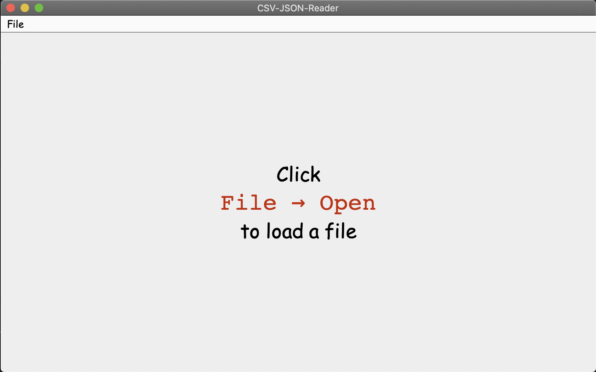
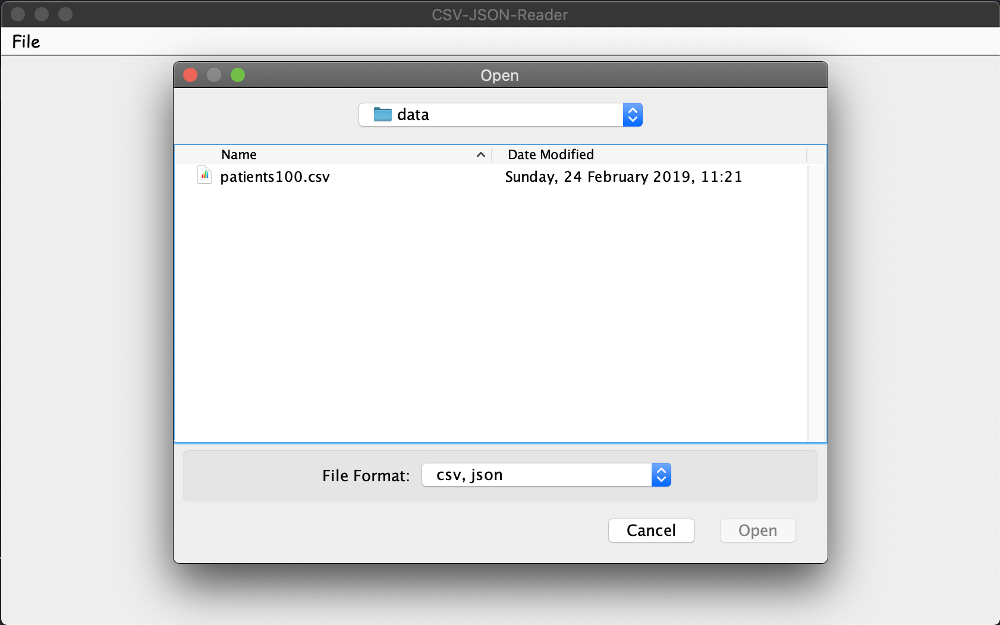
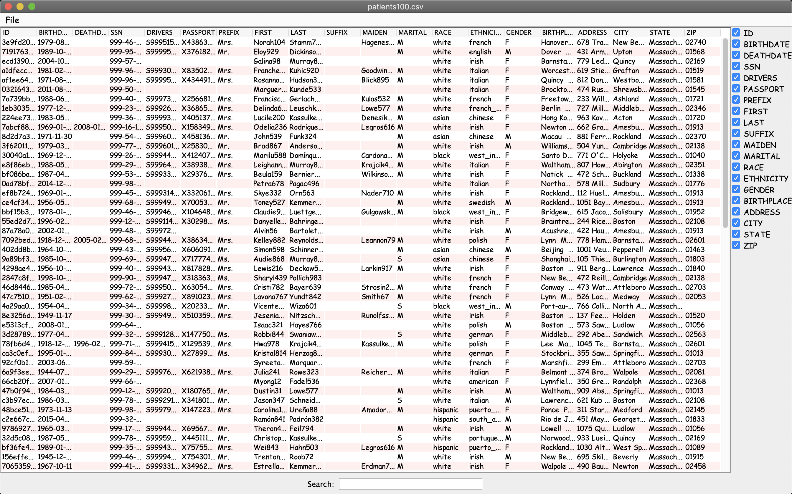

# CSV JSON Reader

A GUI which reads a CSV/JSON and displays the data.

  
  

  

# Features

- Display data from a CSV
- Display data from a JSON
- Save a CSV as a JSON
- Filter data by column
- Search the data
